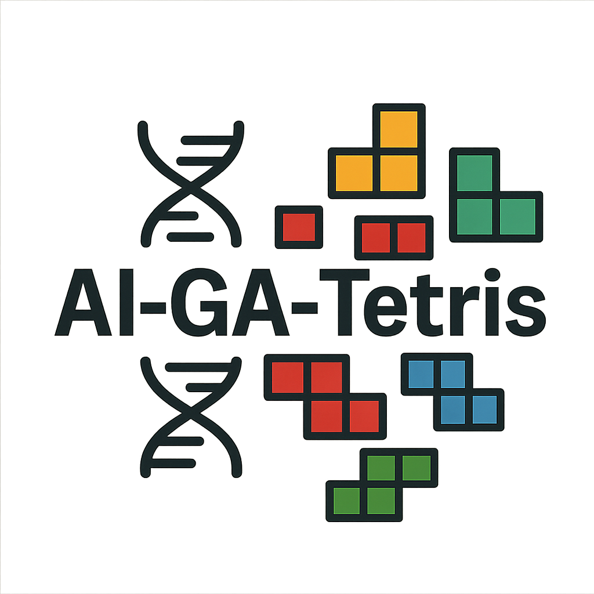

<div align="center">
  
</div>

# AI-GA-Tetris

[](https://openjdk.java.net/)
[](https://spring.io/projects/spring-boot)
[](https://maven.apache.org/)
[](LICENSE)

A Tetris game implementation featuring a Genetic Algorithm-powered AI that learns to play optimally through evolutionary computation. Built with Java, Spring Boot, and Swing for the graphical interface.

## 🎮 Features

- **Classic Tetris Gameplay**: Full implementation of the classic Tetris game with all standard mechanics
- **Genetic Algorithm AI**: Self-learning AI that evolves through generations to improve gameplay
- **Multiple Game Modes**:
  - **Human Play**: Traditional Tetris gameplay for human players
  - **AI Watch Mode**: Watch the trained AI play automatically
  - **AI Training Mode**: Train the genetic algorithm to improve AI performance
- **Configurable Parameters**: Adjustable genetic algorithm settings for experimentation
- **Sound Support**: Optional sound effects and background music
- **Generation Persistence**: Save and load AI generations for continued training

## 🧬 Genetic Algorithm Details

The AI uses a genetic algorithm with the following characteristics:

- **Population Size**: Configurable (default: 4, must be multiple of 4)
- **Mutation Rate**: 5% by default
- **Fitness Evaluation**: Multiple runs per candidate for reliable scoring
- **Reproduction Methods**:
  - Crossover between parent chromosomes
  - Top-half selection for breeding
  - Twin prevention to maintain diversity
- **AI Weights**: 7-dimensional weight vector optimizing:
  - Edge touching penalties
  - Wall touching penalties
  - Floor touching penalties
  - Height penalties
  - Hole penalties
  - Blockade penalties
  - Line clear rewards

## 🚀 Quick Start

### Prerequisites

- Java 8 or higher
- Maven 3.3 or higher

### Installation

1. **Clone the repository**
   ```bash
   git clone https://github.com/yourusername/ai-ga-tetris.git
   cd ai-ga-tetris
   ```

2. **Build the project**
   ```bash
   mvn clean install
   ```

3. **Run the application**
   ```bash
   mvn spring-boot:run
   ```

   Or run the main class directly:
   ```bash
   java -jar target/ai-tetris-0.0.1-SNAPSHOT.jar
   ```

## ⚙️ Configuration

The application behavior is controlled through `src/main/resources/application.yml`:

### Game Modes

```yaml
app:
  use_sounds: false      # Enable/disable sound effects
  use_ai: true          # Enable AI control
  train_ai: true        # Enable AI training mode
```

**Mode Combinations:**
- `use_ai: false` → Human play mode
- `use_ai: true, train_ai: false` → Watch AI play
- `use_ai: true, train_ai: true` → Train AI

### Genetic Algorithm Settings

```yaml
genetic_algo:
  population: 4                    # Population size (must be multiple of 4)
  mutation_rate: 0.05             # Mutation probability (0.0-1.0)
  runs_per_eval: 3                # Number of games per evaluation
  serialize_generation: true      # Save generations to disk
  use_loadedGeneration: false     # Load previous generation
  use_preset_population: true     # Use preset starting population
  reproduction:
    useTopHalf: true              # Select top 50% for breeding
    useCrossover: true            # Use crossover reproduction
    useParentsAverage: false      # Average parent weights
    useTwinPrevention: true       # Prevent identical offspring
```

## 🎯 Game Controls

### Human Play Mode
- **Arrow Keys**: Move and rotate pieces
- **Space**: Hard drop
- **P**: Pause/Resume
- **R**: Restart game

### AI Modes
- The AI automatically plays using the genetic algorithm
- Training mode shows generation progress and statistics
- Watch mode displays the best-performing AI from training

## 📊 Understanding the AI

The genetic algorithm evaluates each AI candidate based on:

1. **Board State Analysis**: Evaluates the current game board
2. **Piece Placement**: Finds optimal positions for incoming pieces
3. **Scoring Function**: Uses weighted criteria to rate positions
4. **Evolution**: Better-performing AIs pass their "genes" to the next generation

### AI Weight Parameters

The AI uses 7 weights that control decision-making:

| Weight | Description | Default Value |
|--------|-------------|---------------|
| `_TOUCHING_EDGES` | Penalty for pieces touching edges | 3.97 |
| `_TOUCHING_WALLS` | Penalty for pieces touching walls | 6.52 |
| `_TOUCHING_FLOOR` | Penalty for pieces touching floor | 0.65 |
| `_HEIGHT` | Penalty for board height | -6.78 |
| `_HOLES` | Penalty for gaps in the board | -3.31 |
| `_BLOCKADE` | Penalty for blocked spaces | -0.59 |
| `_CLEAR` | Reward for line clears | 3.6 |

## 🔬 Experimentation

### Custom Starting Populations

Create custom starting populations by modifying `src/main/resources/generations/presetGeneration.csv`. Each line represents one AI candidate with 7 weight values.

### Parameter Tuning

Experiment with different genetic algorithm parameters:
- **Population Size**: Larger populations explore more solutions but take longer
- **Mutation Rate**: Higher rates increase exploration but may disrupt good solutions
- **Runs per Evaluation**: More runs provide more reliable fitness scores

## 🏗️ Project Structure

```
src/main/java/com/fermanis/aitetris/
├── AiTetrisApplication.java      # Main application entry point
├── GameWindow.java              # Main game window and UI
├── TetrisPanel.java             # Game rendering and input handling
├── TetrisEngine.java            # Core game logic and mechanics
├── TetrisAI.java                # AI decision-making algorithm
├── GeneticAIAlgorithm.java      # Genetic algorithm implementation
├── Tetromino.java               # Tetris piece definitions
├── Block.java                   # Individual block representation
├── SoundManager.java            # Audio management
└── ProjectConstants.java        # Global constants and utilities
```

## 🎵 Audio Features

The game includes optional sound effects and background music:
- Piece rotation sounds
- Line clear effects
- Game over audio
- Background MIDI music

Enable sounds by setting `app.use_sounds: true` in the configuration.

## 🔮 Future Features

- **Record & Clone Mode**: Record human gameplay and create AI that mimics the player's style
- **Multiplayer AI**: AI vs AI competitions
- **Advanced Visualization**: Real-time genetic algorithm visualization
- **Web Interface**: Browser-based version with enhanced UI
- **Performance Analytics**: Detailed statistics and performance tracking

## 🤝 Contributing

1. Fork the repository
2. Create a feature branch (`git checkout -b feature/amazing-feature`)
3. Commit your changes (`git commit -m 'Add amazing feature'`)
4. Push to the branch (`git push origin feature/amazing-feature`)
5. Open a Pull Request

## 📝 License

This project is licensed under the MIT License - see the [LICENSE](LICENSE) file for details.

## 🙏 Acknowledgments

- Classic Tetris game mechanics
- Genetic algorithm concepts and implementation
- Spring Boot framework for application structure
- Java Swing for the graphical interface

---

**Author**: Zac Fermanis  
**Version**: 0.0.1-SNAPSHOT  
**Last Updated**: 2024
